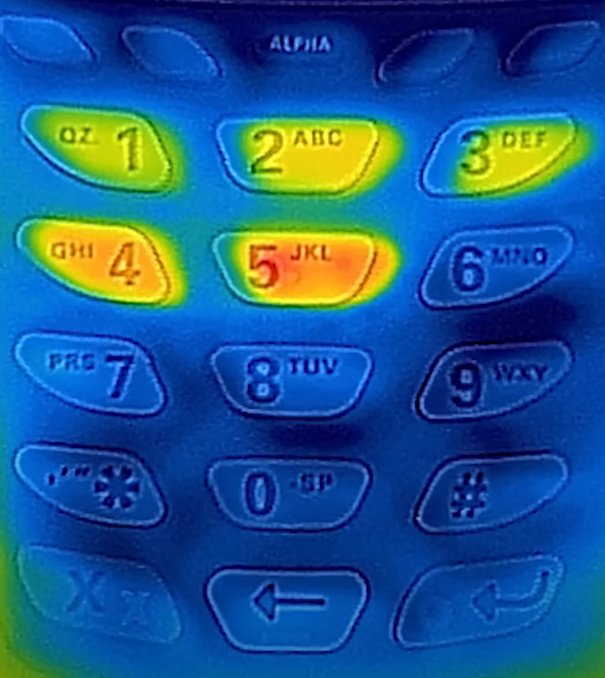

# Credit Card Security
Welcome to a succinct yet thorough exploration of credit card security, focusing on the mechanisms of theft and misuse. This guide delves into the operational foundations of credit cards, shedding light on their functionality and the vulnerabilities that fraudsters exploit. By understanding the inner workings of credit card transactions, we equip ourselves with the knowledge to identify and prevent potential threats, safeguarding our financial integrity against unauthorized access and abuse.

Feel free to correct any mistakes. This guide was written in an attempt to learn about credit cards, and may contain mistakes.

## Disclaimer

Please note that the content provided in this document is intended solely for educational purposes. The aim is to raise awareness and provide information on credit card security and related topics. This document is not meant to serve as a comprehensive guide and should not be interpreted as encouragement or instruction to engage in any form of illegal activity. 

I strongly advise against any illegal actions and recommend always adhering to the laws and regulations of your jurisdiction. Stay informed and use this information responsibly.


## Table of Contents
1. [Introduction](#introduction)
2. [How are Credit Cards Stolen](#how-are-credit-cards-stolen)
    - [Social Media](#social-media)
        - [Explaining the Numbers](#explaining-the-numbers)
        - [Guessing the Card Number](#guessing-the-card-number)
    - [NFC/EMV Capturing](#nfcemv-capturing)
    - [Magnetic Stripe](#magnetic-stripe)
    - [Physical Theft and PIN Stealing](#physical-theft-and-pin-stealing)
    - [Dark Web Activities](#dark-web-activities)
3. [Using the Obtained Details](#using-the-obtained-details)
4. [Other Things to Consider](#other-things-to-consider)
5. [Protection](#protection)
    - [NFC Blockers](#nfc-blockers)
    - [One-Time Cards](#one-time-cards)
    - [Alerts on Payment](#alerts-on-payment)
    - [Credit Score Monitoring](#credit-score-monitoring)
    - [Insurance](#insurance)
6. [Conclusion](#conclusion)


## Introduction
Within this repository, I aim to demystify the various facets of credit card fraud by compiling a comprehensive list of information on the subject. Recognizing the scarcity of detailed resources available online and the critical importance of this issue, I felt compelled to create this guide. It is designed exclusively for educational purposes, with the goal of enlightening individuals on the intricacies of credit card security. By providing this knowledge, my intention is to equip people with the tools they need to protect themselves and to promote a broader understanding of how to navigate the complexities of financial security in today's digital world.

## How are Credit Cards Stolen?
There are numerous ways that the details of a credit card can be stolen. This list included the most creative and common ways it can be done. There are certainly more ways it could be done.

### Social Media
Have you ever noticed how many mirror selfies there are on social media platforms? It doesn't take a long time to find some mirror selfie that has cards in the back of their phone case, inadvertently revealing parts of their credit cards.


(Poorly generated DALL-E picture, but you get the point)

You might notice that his fingers cover up parts of the number. Well, that might not be enough. Let me explain what the card numbers mean.

#### Explaining the Numbers
Let's say we have the following card number:\
`4106510012385673`

These numbers are not completely random. The very first number (MII) reveals the card's issuing entity. Below is a list of which first numbers correspond to which issuing entity:

3: American Express\
4: Visa\
5: Mastercard

And if we take the first 6 digits (410665), we have the BIN (Bank Identification Number). This is key to identifying the bank that issued the card. You can find several [good lists](https://github.com/iannuttall/binlist-data) and [pages online](https://binlist.net/) for identifying which banks are connected to these numbers. This means that, if we know which bank issued the card, we also know the first 6 digits. Often, the logo of the bank is visible on the card, making it very easy to guess.

The rest of the numbers are generated at random, to a certain extent. They are actually generated using the [Luhn Algorithm](https://en.wikipedia.org/wiki/Luhn_algorithm), or MOD10. This is the algorithm used by websites to check that your card details are valid. It is **not** an algorithm for security, it is simply an algorithm for avoiding accidental errors.

#### Guessing the Card Number
So, suppose a digit is missing from the card number. Knowing that the card uses the Luhn algorithm means that there is only one correct digit. Let's make a quick Python script to brute force the missing digit:

```python
from itertools import product
import sys

def luhn_check(card_number):
    def digits_of(n):
        return [int(d) for d in str(n)]
    
    digits = digits_of(card_number)
    odd_digits = digits[-1::-2]
    even_digits = digits[-2::-2]
    checksum = sum(odd_digits)
    for d in even_digits:
        checksum += sum(digits_of(d * 2))
    return checksum % 10 == 0

def find_missing_digits(partial_card_number):
    total = 0
    missing_indices = [i for i, x in enumerate(partial_card_number) if x == '*']
    for replacement in product('0123456789', repeat=len(missing_indices)):
        test_number = list(partial_card_number)
        for index, digit in zip(missing_indices, replacement):
            test_number[index] = digit
        test_number_str = ''.join(test_number)
        if luhn_check(int(test_number_str)):
            total += 1
            print(test_number_str)

    print("Total number of combinations: " + str(total))

partial_card_number = sys.argv[1] 
find_missing_digits(partial_card_number)
```
This script accepts a card number, and fills in the missing digits. Let's say we give it the card number `41065100123*5673`:

```
henrik@henrik:~/Documents$ python3 luhn.py 41065100123*5673
4106510012385673
Total number of combinations: 1
```

Only one card number will be valid. However, the number of combinations increases exponentially with each additional missing digit. For example, if there are three missing digits, there are 10² , possible combinations that technically are valid, but only one will be the card you are looking for.

41065100638190** = 10¹ = 10\
4106510063819*** = 10² = 100\
410651006381**** = 10³ = 1000

But let's say the first 6 digits are missing, but the bank's name is visible on the card. We can then find a BIN list and search for the bank. In this case, let's say the visible number is:

`******0012385673`\
and there is a logo of "Sparebank 1", a Norwegian bank. If we search for "Sparebank 1" in our BIN list, we find:

|iin_start|scheme|type   |bank_name          |
|-------- |------|-------|----------------   |
| 410651  | visa | debit | NO SPAREBANK 1    |

If we combine this with the Luhn brute force, we see that the card numbers can be guessed, even if up to six numbers are missing.

In addition to this, some cards have **all** information visible on one side. Most cards have the CVV on the back, which makes it more secure to the "selfie attack", but for some reason not all.


### NFC/EMV Capturing
Did you know the chip in your card uses "NFC" or Near Field Communication? This technology requires the card to be close to a reader to exchange data. It’s designed for convenience - tap your card, and you're done. But there's a catch.

NFC's convenience also makes it a target. Some have even engineered [devices to capture card data from meters away](https://youtu.be/Qt2Gn2CoJ74?t=320). Think about that next time you're in a crowded place.

Another threat comes from "skimmers." These devious devices are attached to regular bank terminals, duplicating your card’s details without you knowing. Crafty criminals place these skimmers where you'd least expect them.

But, here's the good news: cloning your credit card isn't easy. Cards come with transaction signing keys that are extremely difficult to extract. These systems ensure the data sent is unique every time, based on secure, non-extractable information. This makes it near impossible to for an attacker to clone your card and physically use it in a store. Additionally, the PIN code is only known by you. But we will discuss ways of getting this later.

But even with these security measures in place, critical details of your card can still be compromised. By using your phones NFC scanner, you can easily capture the full card number, expiration date, and other vital details. While it might not seem enough, this information is far from useless to a criminal. It could be all they need to access your funds.

### Magnetic Stripe
Unlike its more modern counterpart, NFC, the data stored on a magnetic stripe is entirely static. What does this mean? Each time you swipe your card, the same unchanging data is read by the card reader. This includes your card number, expiration date, and more.

This static nature is precisely what makes magnetic stripes a security concern. Since the data doesn't change, it's alarmingly easy for criminals to clone. All it takes is a simple device to read the stripe's data and transfer it onto a counterfeit card. Suddenly, they have everything they need to make unauthorized transactions.

The good news is that the financial industry is moving away from this outdated technology. Magnetic stripes are gradually being phased out, replaced by more secure alternatives like chip-and-PIN and NFC. These newer technologies are dynamic, changing their authentication data with each transaction, making them much harder to clone.

So, why are magnetic stripes still around? Unfortunately, the transition to newer technologies isn't instantaneous. It requires widespread changes in infrastructure, from ATMs to point-of-sale systems worldwide. Plus, magnetic stripes serve as a backup in regions where chip-and-PIN or NFC technologies are not yet fully implemented.

If you want to learn more about the magnetic stripe and its vulnerabilites. I highly recommend watching [Samy Kamkar’s video](https://www.youtube.com/watch?v=UHSFf0Lz1qc) on the subject. He has developed vulnerabilities and devices used for attacking magnetic stripes, and will explain the theory behind the stripe and attack much better than me.

### Physical Theft and PIN Stealing
Physical theft still remains a concern. But, even if a thief gets your card, cracking your PIN is another hurdle.

But! Some criminals use [infrared cameras to snap a quick photo of the keypad](https://www.youtube.com/watch?v=8Vc-69M-UWk) right after you've entered your PIN. The heat signature reveals the numbers pressed - the warmest being the most recent. It's like a heat map to your PIN code. This does, however, not work for metal buttons, as metal has a high thermal conductivity. This means that it will rapidly transfer heat, making it impossible for an attacker to see what you pressed.

Can you guess the PIN code from the image below?


(screenshot from Mark Rober's video)

Correct, the code is 1,2,3,4,5. 5 being the hottest (most recent), and 1 being the coolest (first).

And don't forget about hidden cameras. Positioned just right, these can record your PIN as you enter it. Covering your PIN code is always a good idea.

### Dark Web Activities
Venture into the dark web, and you'll find hidden marketplaces where anything is up for sale, including stolen credit card details.

In these markets, credit card information isn't exchanged as physical cards but rather as digital files. These files contain complete details necessary for making unauthorized purchases. The price of this stolen data varies greatly. High-balance cards, or those without 2FA (Two-Factor Authentication), have a higher price. However, for skilled cybercriminals, 2FA is merely a hurdle, not a blockade. We'll explore their bypass methods later.

But the trade doesn't stop at credit cards. The dark web is also full of illicit sales of compromised PayPal accounts, cryptocurrency wallets, among other digital assets.

So you may ask, why don't these cybercriminals use the stolen details themselves, especially when they sell them for much less than their worth? There are several reasons. Many sellers have large amounts of data that is obtained through botnets, making it impractical to exploit each piece of data individually. While some may fear the risks of getting caught, others might lack the means or expertise to exploit these accounts fully. Successfully using this data without detection involves complexities and risks that go beyond what I can cover here.

## Using the Obtained Details
Now that a criminal has access to your credit card information, what's their next move? You might imagine them cloning the card for physical shopping sprees, but the reality is often different and more digitally oriented.

Contrary to popular belief, cloning a credit card for physical use isn't the go-to method for fraudsters. Remember our discussion about NFC chips? They're incredibly challenging to duplicate with standard equipment. And while magnetic stripes are more vulnerable, their gradual phase-out makes them less appealing. Moreover, in many places, finding stores that still accept swipe transactions is becoming increasingly difficult.

Even if they manage to clone the card, there's the hurdle of obtaining the PIN. Plus, using a cloned card in stores carries significant risks – security cameras, potential eyewitnesses, and the chance of leaving behind fingerprints. It's a gamble with high stakes.

Instead, criminals often opt for the path of least resistance: using your card online. The digital realm offers a veil of anonymity and eliminates the need for sophisticated cloning equipment. It's simpler, safer (for the criminal), and often more lucrative to misuse stolen card details in the virtual world. Online transactions produce less physical evidence (if done correctly), making it harder to trace back to the fraudster.

Picture this scenario: a criminal stumbles upon an image of your credit card on social media. With a bit of clever calculation and some basic information from your online profiles, they now have everything: your full card number, expiration date, name, and even the CVV.

You might feel a sense of security, thinking, "I'm protected; I have 2-FA enabled." Two-Factor Authentication is indeed a robust security feature, often involving a verification code sent to your phone. However, there's a catch.

The implementation of 2-FA isn't solely in your bank's hands; it's also at the discretion of the merchants. While some prioritize security by requiring this extra step, others opt for a more streamlined checkout process, bypassing additional verification to facilitate quicker purchases. This is particularly common among foreign online retailers.

For you, the cardholder, this means that not all transactions are equally safeguarded. If your card details are used at a merchant that doesn't require 2-FA, the transaction could proceed unchallenged.

In case of a fraudulent charge, the burden of proof lies with the merchant. As a cardholder, you have the right to dispute any unfamiliar charges on your bill. Having 2-FA enabled will make it easier for the merchant to prove that you were the one to actually make the purchase, making it harder to dispute.

But not only this, criminals have other ways of getting around 2-FA. There is something called [SIM Swapping](https://en.wikipedia.org/wiki/SIM_swap_scam). 

```
“The fraud exploits a mobile phone service provider's ability to seamlessly port a phone number to a device containing a different subscriber identity module (SIM). This mobile number portability feature is normally used when a phone is lost or stolen, or a customer is switching service to a new phone.”
-Wikipedia
```
This means that the attacker needs to trick the service provider into swapping the number to a different phone. This attack is more common than you would think.

There are also mentions of large websites not requiring the CVV code, as again, this is only an additional step to prove that you made the purchase. It is not actually needed in order to make a purchase. However, I have not personally been able to find any websites that does not require the CVV.

## Other Things to Consider
I thought I should also quickly mention “fullz”.

Fullz is underground slang for the comprehensive set of personal data collected about an individual. This isn't just a scattering of personal details. We're talking about a complete, packaged identity, ripe for misuse.

What does fullz include? Fullz includes all information necessary to impersonate you: your social security number, driver's license number, full name, date of birth, your home address, and phone number.

With these details, a fraudster can wreak havoc. They could apply for credit card loans in your name, while cleverly diverting all bank communications to themselves. The chilling part? You wouldn't even know that a loan is being taken out under your name. You're left in the dark while the fraudster operates in the light.

And where is this sensitive information traded? Well, again, on the dark web, fullz can be shockingly cheap – usually not more than a dollar. The lower price, however, doesn't lessen the potential damage. It's a full-fledged identity theft kit, priced less than a cup of coffee.

## Protection
Now that we've discussed ways of stealing your information, let's talk about how to protect yourself.

### NFC Blockers
You've likely seen ads for RFID-blocking wallets. These wallets use materials that interfere with RFID signals, preventing scanners from reading your card data. Want a DIY solution? Wrapping your cards in aluminum foil is a surprisingly effective and inexpensive home alternative.

### One-Time Cards
Many services now offer virtual, one-time-use cards. You can generate multiple virtual cards for different transactions. Once a payment is completed, you can simply delete the card. This is a great way to safeguard against the theft of your actual card numbers, especially in online transactions.

### Alerts on Payment
With "Alerts on Payment" from your banking app, you'll get immediate notifications for every card transaction. This instant update lets you act fast if there's any unauthorized use, helping you to quickly contest suspicious charges. It's an essential tool for staying on top of your transactions without needing to constantly review your statements.

### Credit Score Monitoring
Unnoticed, someone could be misusing your identity to apply for credit cards or loans. Regularly checking your credit score is key to catching this. If a fraudster racks up debt in your name, it won't be paid back, causing your credit score to plummet. Watch for any unexpected, significant changes – it's often the first sign that something's amiss.

### Insurance
This is an often-overlooked layer of protection. Credit card insurance can cover losses due to fraudulent transactions, identity theft, and even accidental purchases. In the event of fraud, the insurance may reimburse unauthorized transactions, providing an added financial safety net. This insurance can be a standalone policy or part of a premium credit card offer. It's about ensuring peace of mind, knowing that you're covered in the worst-case scenarios.

## Conclusion
And that brings us to the end of our journey today. While much of the information shared was drawn from American sources, the principles of credit card security we've discussed are universal. However, specifics can vary by region, so I highly encourage you to delve into the rules and regulations pertinent to your locality for tailored protection strategies.


So, to recap some of the key points in this guide:
- Accidental pictures of credit cards can be used to make purchases, even with information missing.
- Your card can be scanned from several meters, revealing your sensitive information.
- The security of online transactions.
- Safety measures to protect you.

Please feel free to correct any information here, as I do not want to spread misinformation, and I would love to learn something new.
